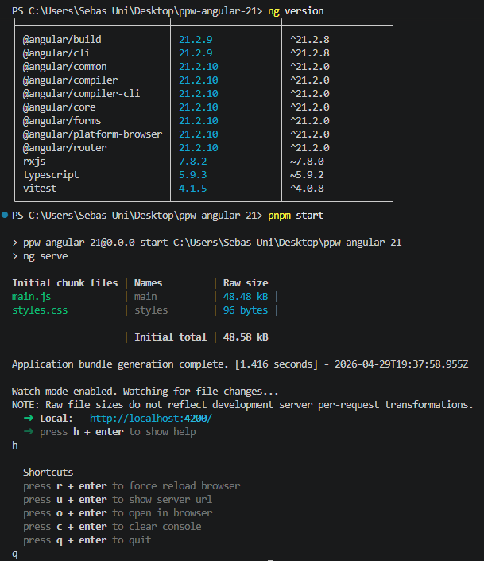
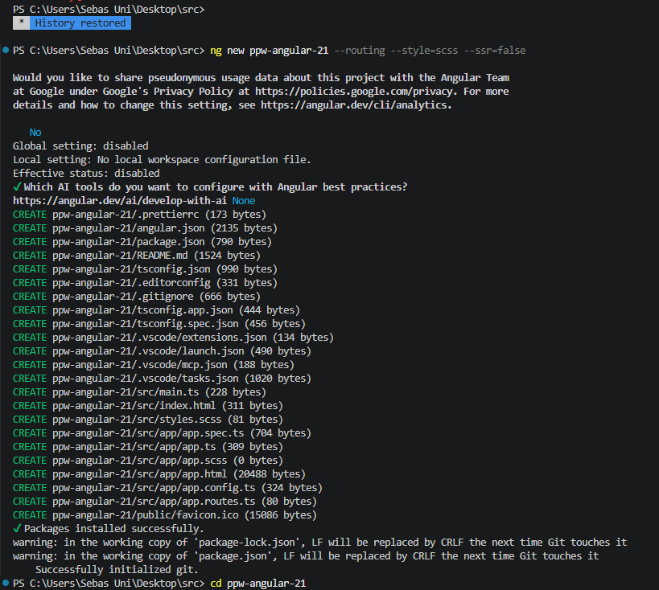
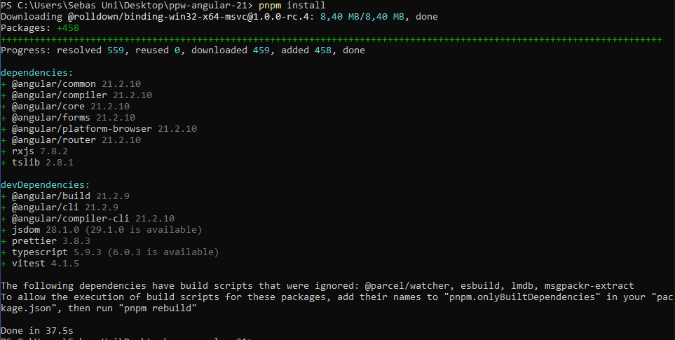
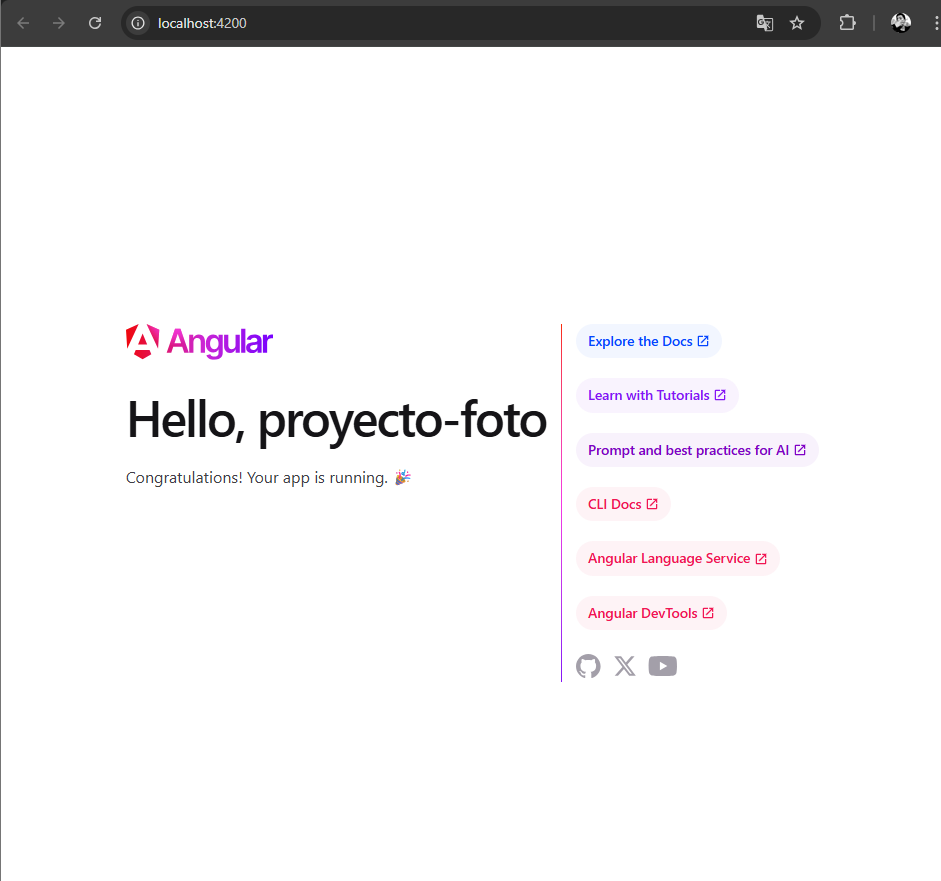
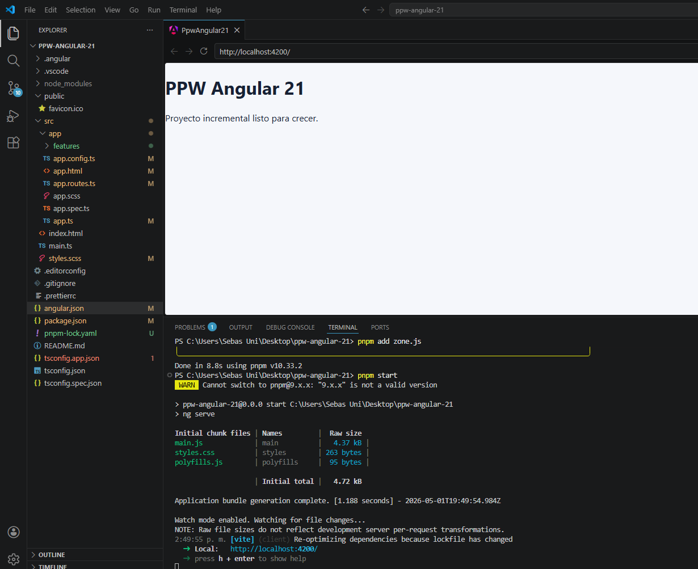

# Practica 01 - Angular 21

**Autor:** Sebastián Alvarado
**Correo institucional:** salvaradom1@est.ups.edu.ec
**User GitHUB:** sebmrd

---

## Objetivo del Proyecto

El objetivo principal de esta práctica es inicializar y configurar el proyecto incremental `ppw-angular-21` utilizando el framework Angular en su versión 21[cite: 1]. Se busca establecer una arquitectura base sólida, con el sistema de enrutamiento (routing) habilitado y una estructura de carpetas modular orientada a funcionalidades (*features*)[cite: 1]. Esta configuración inicial está diseñada para ser escalable, permitiendo el desarrollo de los módulos posteriores del curso sobre la misma base de código sin necesidad de refactorizaciones estructurales profundas[cite: 1].

---

## Desarrollo Técnico y Resoluciones

Durante la ejecución de la práctica, se llevaron a cabo los siguientes procesos técnicos:

1. **Inicialización del Entorno:** 
   Se generó la aplicación mediante Angular CLI utilizando el comando `ng new ppw-angular-21 --routing --style scss --ssr=false`[cite: 1], garantizando el uso de preprocesadores de estilo (SCSS) y desactivando el Server-Side Rendering (SSR) para mantener una arquitectura tradicional de Single Page Application (SPA).

2. **Estructuración Modular (Feature-Based):** 
   Para evitar un crecimiento caótico del proyecto[cite: 1], se implementó una arquitectura basada en *features*. Se creó la ruta de directorios `src/app/features/home/pages/`[cite: 1] para alojar el componente principal de inicio, separando claramente la lógica de la página de la configuración global de la aplicación.

3. **Configuración de Componentes Standalone:** 
   Se desarrolló el componente `HomePage` (`home-page.ts`)[cite: 1] configurado explícitamente con la propiedad `standalone: true`. Esto permite que el componente funcione de manera independiente sin necesidad de ser declarado en un módulo tradicional (`NgModules`), alineándose con las mejores prácticas de las versiones recientes de Angular.

4. **Implementación del Sistema de Enrutamiento:** 
   Se configuró el archivo `app.routes.ts`[cite: 1] para gestionar la navegación. Se definió la ruta raíz (`path: ''`) apuntando al componente `HomePage`, y se implementó una ruta comodín o *wildcard* (`path: '**'`) para redirigir cualquier URL no reconocida hacia la página de inicio, mejorando la experiencia de usuario y evitando pantallas en blanco[cite: 1].

5. **Limpieza y Optimización del Componente Raíz:** 
   Se simplificó el componente principal `app.component`[cite: 1], eliminando el código *boilerplate* generado por defecto. El archivo HTML se redujo únicamente a la etiqueta `<router-outlet />` contenida dentro de una etiqueta `<main>` con la clase `.app-shell`[cite: 1], delegando todo el renderizado de vistas al sistema de rutas.

6. **Resolución de Dependencias (Zone.js):** 
   Para garantizar el correcto funcionamiento del sistema de detección de cambios de Angular configurado mediante `provideZoneChangeDetection` en `app.config.ts`[cite: 1], se instaló y configuró la librería `zone.js`. Se actualizó el archivo `angular.json` para incluir `"zone.js"` en el arreglo de `polyfills`, asegurando la compilación exitosa del proyecto con Vite.

7. **Configuración de Estilos Globales:** 
   Se estableció una base visual neutra en `styles.scss`[cite: 1], definiendo tipografías (Inter, system-ui), colores de fondo y reseteando los márgenes del `body`[cite: 1], preparando el terreno para la futura integración de frameworks CSS como Tailwind.

---

## Evidencias de la Práctica

A continuación se presentan las capturas de pantalla que validan la correcta instalación, configuración y ejecución del proyecto, cumpliendo con los entregables solicitados[cite: 1]:

### 1. Versión de Angular CLI
*Validación en la terminal comprobando que el entorno utiliza una versión compatible de Angular CLI (>= 21) y Node.js.*

### 2. Creación del Proyecto
*Proceso de inicialización y descarga de paquetes mediante el comando `ng new` con las banderas de configuración requeridas.*

### 3. Aplicación por Defecto
*Página de bienvenida estándar generada automáticamente por Angular, documentada antes de proceder con la limpieza del código.*

### 4. HomePage Configurado (Resultado Final)
*Validación del componente `HomePage` renderizado correctamente en el navegador a través de `http://localhost:4200`[cite: 1]. Demuestra el éxito del enrutamiento, la inyección de dependencias y la compilación sin errores.*

